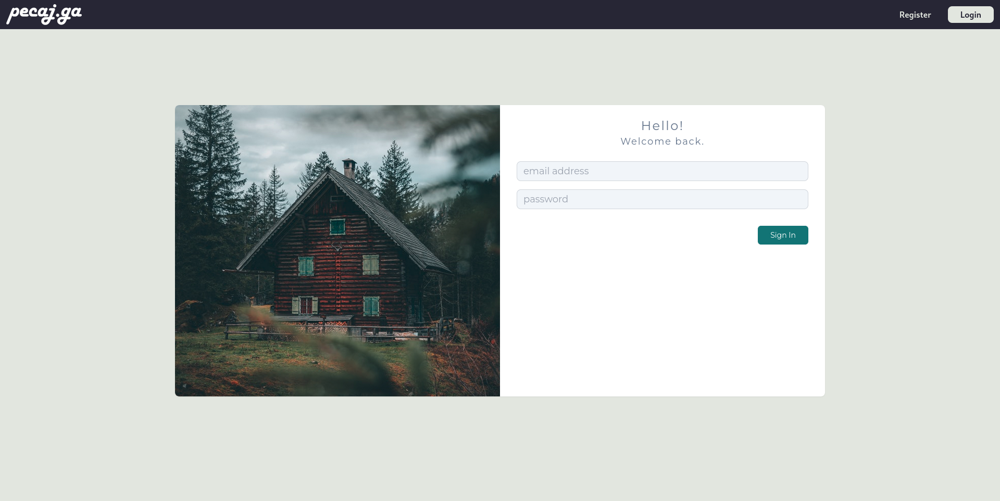
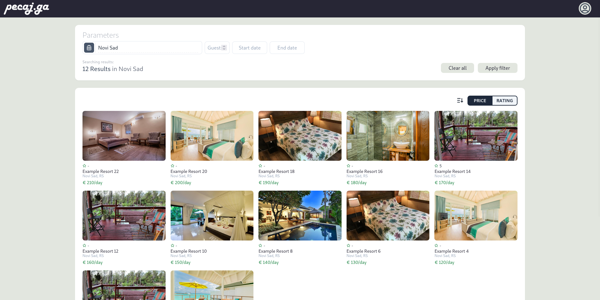
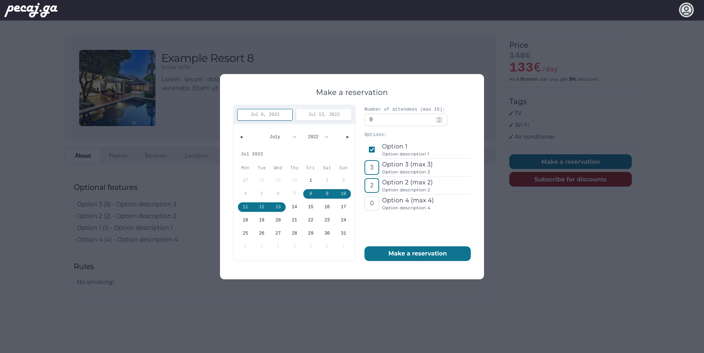
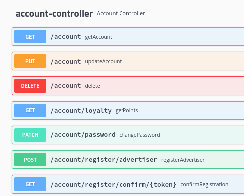
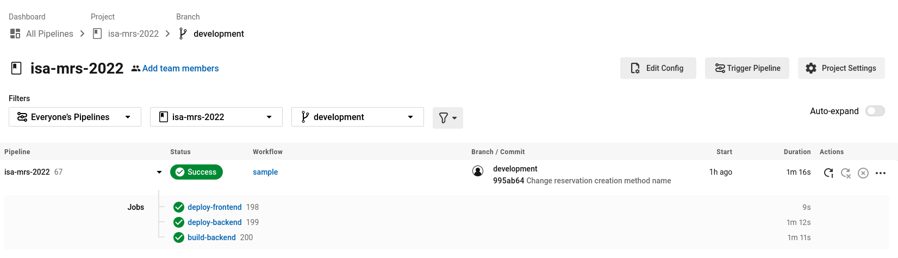
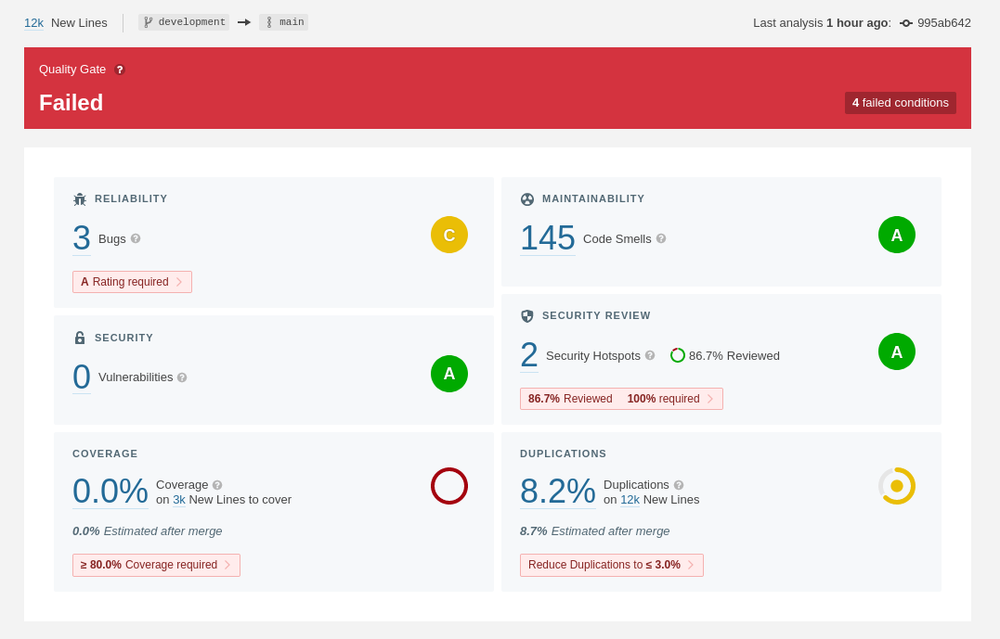
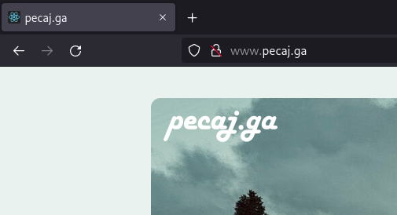
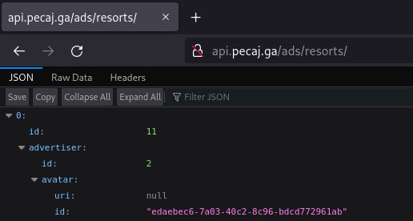

# pecaj.ga — ISA/MRS Project


Full stack web application for advertising and renting resorts, boats and adventures. Built using Spring Boot 🍃, React ⚛️ and Tailwind CSS.

## Authors
- Dušan Lazić SW 4 2019
- Ana Anđelić SW 14 2019
- Milan Sekulić SW 54 2019

## Getting started 🔌

### Live demo (Heroku) 🚀

- Frontend: **[www.pecaj.ga](http://www.pecaj.ga)** 
  - or [pecaj-ga-frontend.herokuapp.com](https://pecaj-ga-frontend.herokuapp.com)


- Backend: **[api.pecaj.ga](http://api.pecaj.ga)** 
  - or [pecaj-ga-backend.herokuapp.com](https://pecaj-ga-backend.herokuapp.com)

### Running locally 🏠 

#### Dependencies 🛠️
- JDK 18
- Node v16.3.0
- PostgreSQL 14.2

#### Backend — Spring Boot application 🍃

Make sure all dependencies are satisfied. In `src/main/application.properties` configure the datasource for your database, and set your email sender credentials.

Start application using IntelliJ by running `ProjectApplication` configuration, or manually using:
```
$ mvn spring-boot:run
```
Your API will be available at `http://localhost:8080` and Swagger API docs at `http://localhost:8080/swagger-ui.html`.

#### Frontend — React application ⚛️
Make sure all dependencies are satisfied. Inside `/client` run:
```
$ npm install
$ npm run dev
```
Your SPA will be served at `http://localhost:3000`

## Credentials 🔑
### Password: `cascaded`
- superuser (main admin): `admin@pecaj.ga`
- resort owner: `sinisa@pecaj.ga`
- boat owner: `draganb@pecaj.ga`
- fishing instructor: `lazard@pecaj.ga`
- customer: `stevade@pecaj.ga`

## Screenshots 📸

### Frontend








### Swagger API documentation



### DevOps (micro) flow

#### CircleCI



#### SonarCloud



#### Heroku (with Freenom domain name)





